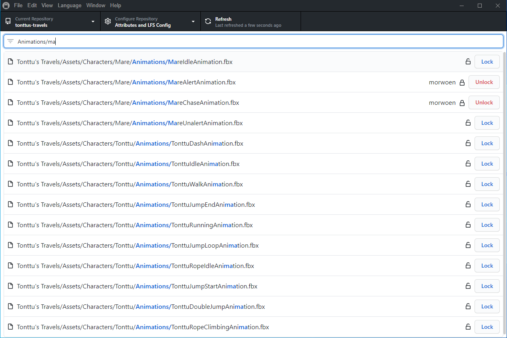

# Git Locks Manager


Git is awesome. However, working on a project with a lot of binary files can be challenging. Especially for non-engineers having to use the git terminal commands. To improve the experience of everybody in your team we developed the Git Locks Manager. A graphical interface to provide a straightforward way of managing the file locks in your repositories.

## :closed_lock_with_key: Get Git Locks Manager
You can download an installer for your operating system from the [latest GitHub Release](https://github.com/Noxdew/git-locks-manager/releases/latest)

Note that the releases are not signed. This means that you OS might tell you that the developer is untrusted and auto-updates won't work on MacOS.



## :sparkles: Features
- View, lock and unlock lockable files in your repositories
- View and edit `.gitattributes` through the UI
- Easily set up custom Git LFS servers
- Uses the GitHub design system to create a familiar interface for GitHub Desktop users
- Translated in 47 languages (Contributions and improvements are welcome)

## :computer: Development

The project is a simple React application wrapped in an Electron desktop app. To start working on it clone/fork the repo, install the dependencies and start the development server.

```
npm i
npm run dev
```

## :beetle: Found a bug?
[Submit an issue](https://github.com/Noxdew/git-locks-manager/issues/new/choose) with as much details as possible on what happened, what you expected and what you were doing when the bug happened.

## :hearts: Contributions
All contributions are welcome. Submit a Pull Request
